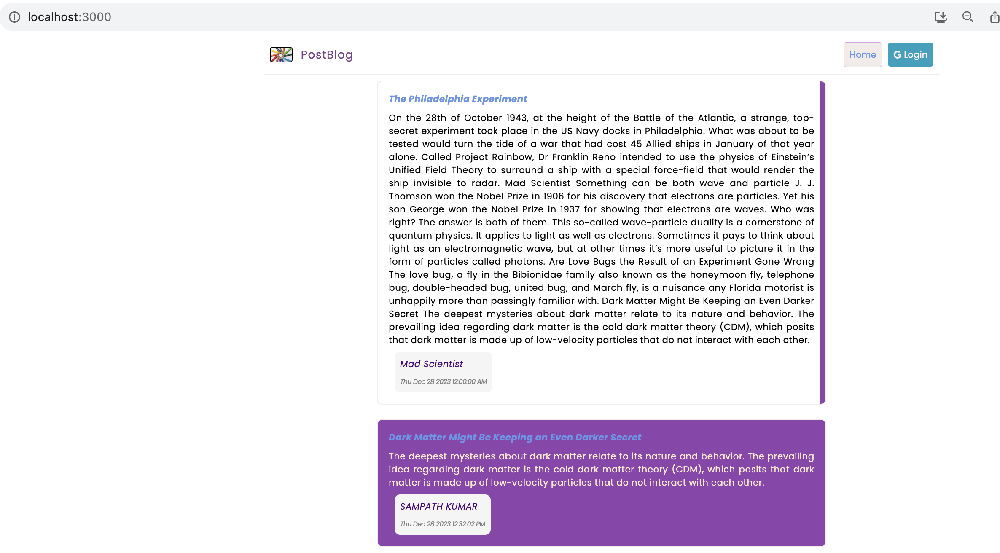
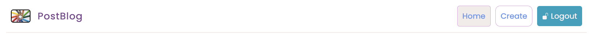
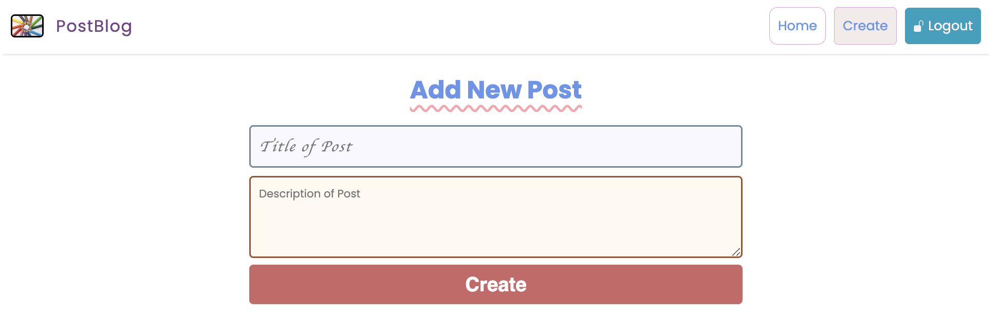

# Postblog

A simple blog posting application with `React` and `Firebase`.

The base application is created using the `create-react-app` template.

## Libraries
The following libraries are required which can be installed with `npm install`.

- `firebase`
- `react-loading-skeleton`
- `react-router-dom@6`

After starting the application using `npm start`, access it through browser via
the link `http://localhost:3000/`.

New *Posts* can be created by *Logging* in through _google_ account and the
existing _Posts_ may be viewed as readonly after accessing the url.

### Screenshots
Here are the screenshots of the system while it is live.

Before login:
[]

After logging using `google` id, the header shows additional options as shown below

[]

New posts can be posted after signing in as shown below

[]

## Offloading Firebase configuration to dotenv

Offloading the `Firebase` configuration information like the api keys and url's can be quite tricky.
The below steps worked:

1. Create a .env file at the root directory of your application and add the variables to it.

```javascript
// contents of .env

REACT_APP_API_KEY = 'my-secret-api-key'
```
*keep in mind a variable needs to start with `REACT_APP_` for it to work.*

2. Add `.env` to your `.gitignore` file so that Git ignores it and it never ends up on GitHub.

3. Access the _ENV_ variable in your application as below:

```javascript
# config.js file or the file you need to access ENV
// Your web app's Firebase configuration
const firebaseConfig = {
    apiKey: `${process.env.REACT_APP_FIREBASE_API_KEY}`,
    authDomain: `${process.env.REACT_APP_FIREBASE_AUTH_DOMAIN}`,
    projectId: `${process.env.REACT_APP_FIREBASE_PROJECT_ID}`,
    storageBucket: `${process.env.REACT_APP_FIREBASE_STORAGE_BUCKET}`,
    messagingSenderId: `${process.env.REACT_APP_FIREBASE_MSGSENDER_ID}`,
    appId: `${process.env.REACT_APP_FIREBASE_APP_ID}`
};
```

## Create React App

This project was bootstrapped with [Create React App](https://github.com/facebook/create-react-app).

### Available Scripts

In the project directory, you can run:

#### `npm start`

Runs the app in the development mode.\
Open [http://localhost:3000](http://localhost:3000) to view it in your browser.

The page will reload when you make changes.\
You may also see any lint errors in the console.

#### `npm run build`

Builds the app for production to the `build` folder.\
It correctly bundles React in production mode and optimizes the build for the best performance.

The build is minified and the filenames include the hashes.\
Your app is ready to be deployed!
